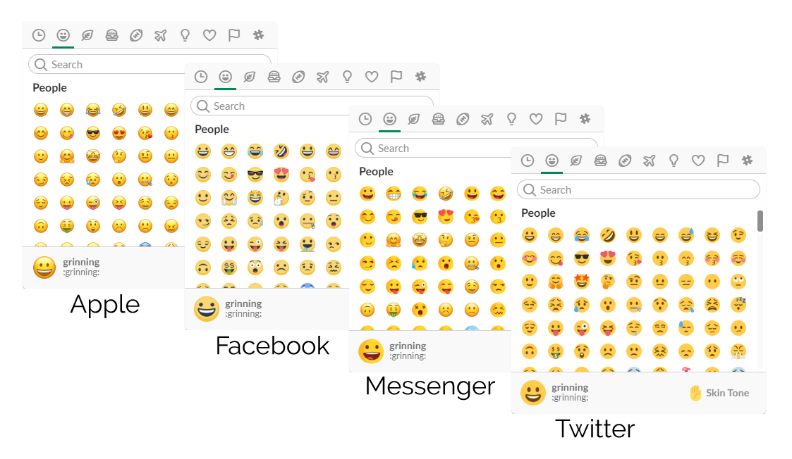

   

# Installation
### Mac
1. Select the Emoji style you want and copy the contents of the corresponding .js file in the scripts folder (for example, apple.js).
1. Navigate to `/Applications/Slack.app/Contents/Resources/app.asar.unpacked/src/static`.
2. Paste the contents of the .js file at the end of **ssb-interop.js**. 
3. Restart Slack to see the effects (Cmd + R works just fine).

### Windows (Automatic)
1. Download the [latest release](https://github.com/Fdebijl/LessAwfulEmoji/releases)
2. Unzip the archive
3. Run install_win.bat

### Windows (Manual)
1. Select the Emoji style you want and copy the contents of the corresponding .js file in the scripts folder (for example, apple.js).
2. Press Win + R to open the Run menu. 
3. Go to `%LOCALAPPDATA%\slack` by pasting this in the Run menu and pressing enter. 
4. (Optional) Alternatively navigate to C:\Users\USERNAME\AppData\Local\slack in Windows Explorer. 
5. Find and open the latest version directory (for example: 3.3.3) and go to `resources\app.asar.unpacked\src\static`. 
6. Paste the contents of the .js file you copied earlier at the end of **ssb-interop.js**. 
7. Restart slack to see the effects (Ctrl + R works just fine).

### Ubuntu
1. Select the Emoji style you want and copy the contents of the corresponding .js file in the scripts folder (for example, apple.js).
2. Navigate to `/snap/slack/9/usr/lib/slack/resources/app.asar.unpacked/src/static`
3. Paste the contents of the .js file you copied earlier at the end of **ssb-interop.js**. 
4. Restart slack to see the effects.

   
# My other projects
## [Cachedview](https://cachedview.nl/)
View cached/archived versions of a page easily and for multiple providers

## [Emojibuilder](https://emoji.debijl.xyz/)
Construct your own emoji/abominations!